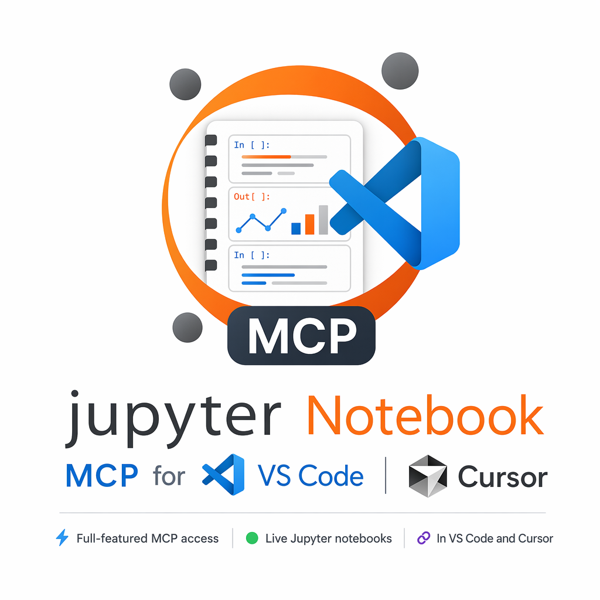

# Notebook MCP for VS Code

<p align="center">
  
</p>

Notebook MCP for VS Code is a local MCP bridge for live Jupyter notebooks in VS Code. It lets coding agents read, edit, reorder, run, stream outputs, save, and export notebooks through the VS Code Notebook API with explicit notebook URI targeting.

**Install:** [VS Code Marketplace](https://marketplace.visualstudio.com/items?itemName=vatsapatel.notebook-mcp-for-vscode) · [Open VSX](https://open-vsx.org/extension/vatsapatel/notebook-mcp-for-vscode) · [GitHub](https://github.com/VatsaPatel/vscode-inmemory-notebook-mcp)

## What This Extension Is

Notebook MCP for VS Code gives MCP-capable coding agents a clear, explicit way to work inside the same notebook the human is using. The agent connects once to a local daemon, discovers the notebooks open across VS Code windows, chooses a `notebook_uri`, and then uses that URI for every read, edit, run, save, and export operation.

The goal is practical autonomy for notebook tasks:

- understand the whole notebook before changing it
- add or refactor cells in the right place
- run code in the notebook's selected Python/Jupyter kernel
- stream long-running output instead of blocking blindly
- keep edits visible in the editor and compatible with undo/redo
- avoid writing to the wrong notebook when the human switches tabs

This is built for agent workflows like:

- "Read this notebook and explain what it is doing."
- "Add a data-quality section after the ingestion step and run it."
- "Move the expensive Spark job below the cache setup, then rerun from that point."
- "Debug the failing cell, keep your diagnostic cells visible, and save the notebook."
- "Export this notebook to Markdown after the final run completes."

## Why It Helps AI Coding Agents

Notebooks are harder for agents than plain source files. Code is split across cells, outputs matter, execution order matters, and the kernel state may not match the saved `.ipynb` JSON on disk. A useful notebook agent needs more than file editing.

Notebook MCP for VS Code gives the agent a compact tool surface built around notebook intent instead of low-level editor primitives:

| Agent intent | Tool support |
|---|---|
| Understand the notebook | `notebook_read` can return the whole notebook, selected ranges, source, outputs, execution state, and stable cell anchors |
| Find where to work | `notebook_search` searches code/markdown and supports explicit replace workflows |
| Make structured edits | `notebook_edit_cells` inserts, updates, deletes, and changes cell types in batches |
| Reorder reliably | `notebook_move_cells` moves one or more anchored cells, then the agent can re-read before continuing |
| Run visible work | `notebook_run` executes a cell, range, all cells, or a short Python probe in the selected notebook kernel |
| Monitor long jobs | `notebook_operation` polls or streams live outputs from running operations |
| Intervene deliberately | `notebook_cancel_execution` and `notebook_kernel_control` are separate destructive tools |
| Finish the workflow | `notebook_save` and `notebook_export` persist or share the result |

The tool names and descriptions are intentionally compact so agents do not have to choose from dozens of overlapping cell-level primitives.

## Why We Built This

We built this because notebook agents need the same live runtime the human sees in VS Code:

- file-based tools can edit `.ipynb` files but cannot reliably execute cells in the editor's selected kernel or see unsaved in-memory changes.
- Jupyter Server API tools work well for standalone JupyterLab/JupyterHub, but add another server/UI/source of truth when the user is already working in VS Code.
- active-tab tools are risky because tab switches can change where an agent writes.
- long-running notebook jobs, especially Spark jobs, need operation IDs and live output streaming instead of one blocking call.

This extension is built for the workflow where the human and the agent collaborate inside the same notebook, using the same kernel, with changes visible immediately in the editor.

## What It Does

- Reads an entire notebook in one call so agents can understand the code before acting.
- Edits notebooks through VS Code's Notebook API, preserving editor undo/redo behavior.
- Inserts, updates, deletes, and reorders cells using `cell_id` anchors instead of fragile active-tab assumptions.
- Runs cells, ranges, all cells, or short throwaway Python probes in the selected notebook kernel.
- Streams live output from long-running operations, useful for Spark progress and errors.
- Requires explicit `notebook_uri` on notebook operations so tab/window changes do not redirect writes.
- Shows editor-visible status markers for agent-touched and locked cells.
- Saves and exports notebooks.
- Keeps one daemon-owned localhost MCP endpoint across VS Code windows.

## How It Works

1. The extension starts a local daemon on `127.0.0.1:49777`.
2. Your MCP client connects once to the global MCP endpoint copied from the command palette.
3. Each VS Code window connects to the daemon as a bridge worker and reports its open notebooks.
4. The agent calls `notebook_status` to discover notebook URIs.
5. The agent passes the chosen `notebook_uri` on every notebook-specific tool call.
6. The daemon routes the request to the right editor window and notebook.
7. The extension applies reads, edits, runs, saves, and exports through VS Code's Notebook API.

That single-endpoint design means the MCP client does not need one URL per notebook or one server per window. The agent can work across windows and notebooks while still targeting each operation explicitly.

### Targeting Model

```text
1. Agent connects once:

   MCP client
     -> global local MCP endpoint

2. Agent discovers notebooks:

   notebook_status
     -> open_notebooks[]
     -> file:///.../analysis.ipynb
     -> file:///.../experiment.ipynb

3. Agent targets every operation explicitly:

   notebook_read({ notebook_uri })
   notebook_edit_cells({ notebook_uri, operations })
   notebook_run({ notebook_uri, scope, cell_id })

4. Daemon routes by URI:

   notebook_uri
     -> matching VS Code bridge window
     -> matching in-memory NotebookDocument
     -> VS Code Notebook API
```

## Design Principles

1. **The notebook visible in the editor is the source of truth.** The agent talks to the same in-memory notebook document the human is editing.

2. **Agents should work by intent, not by low-level VS Code primitives.** The MCP surface is intentionally compact. For example, `notebook_edit_cells` handles insert/update/delete/type-change in one batch tool.

3. **Writes and runs should be explicit, not active-tab based.** The agent gets a `notebook_uri` from `notebook_status` or `notebook_open` and passes it on every notebook operation.

4. **Long-running jobs should be observable.** `notebook_run` returns operation state, and `notebook_operation` can poll live outputs while the cell is still running.

5. **Spark and data work should stay auditable.** For meaningful Spark diagnostics, agents should insert visible cells, run them, and stream output rather than using hidden Spark-specific shortcuts.

## Architecture

```text
┌──────────────────────────────┐
│ AI agent / MCP client        │
│ local coding agents          │
└───────────────┬──────────────┘
                │ Streamable HTTP MCP
                │ global local MCP endpoint
                v
┌──────────────────────────────┐
│ Notebook MCP daemon          │
│ - owns the MCP endpoint      │
│ - tracks open notebooks      │
│ - routes by notebook_uri     │
│ - stores execution ops       │
└───────────────┬──────────────┘
                │ WebSocket bridge RPC
                v
┌──────────────────────────────┐
│ VS Code extension bridge     │
│ - one bridge per window      │
│ - reports open notebooks     │
│ - applies tool requests      │
└───────────────┬──────────────┘
                │ VS Code Notebook API
                v
┌──────────────────────────────┐
│ Live NotebookDocument        │
│ Selected Jupyter/Python      │
│ kernel and cell outputs      │
└──────────────────────────────┘
```

The daemon owns the stable local MCP endpoint. Each VS Code window connects to the daemon as a bridge worker and reports its open notebooks. Tool calls route by the explicit `notebook_uri` supplied by the agent.

This keeps one reliable endpoint for agents while still supporting multiple VS Code windows and notebooks.

## When To Use This

| Use case | Fit |
|---|---|
| AI agent works in notebooks open in VS Code | Best fit |
| Python notebooks with local or remote kernels selected in VS Code | Best fit |
| Spark notebooks where long cells need streamed progress | Best fit |
| Agent should edit cells and run them in the same UI the human uses | Best fit |
| Standalone JupyterLab/JupyterHub without VS Code | Use a Jupyter Server API MCP instead |
| File-only `.ipynb` cleanup without execution | File-based tools may be enough |

## Setup

1. Install the extension in VS Code.
2. Run **Notebook MCP: Copy MCP URL**.
3. Add the copied global daemon URL to your MCP client once.

Example MCP client config:

```json
{
  "mcpServers": {
    "jupyter": {
      "url": "PASTE_THE_URL_FROM_NOTEBOOK_MCP_COPY_MCP_URL"
    }
  }
}
```

Then tell the agent which notebook to use. The agent should call `notebook_status`, choose or open the notebook, and pass the resolved `notebook_uri` on every notebook tool call.

Useful commands:

- **Notebook MCP: Copy MCP URL**
- **Notebook MCP: Copy Current Notebook URI**
- **Notebook MCP: Show Notebook MCP Activity**
- **Notebook MCP: Restart Notebook MCP Daemon**
- **Notebook MCP: Stop Notebook MCP Daemon**

## MCP Tool Surface

The public tool set is Python-focused and intentionally small.

| Tool | When to use |
|---|---|
| `notebook_help` | Unsure how to proceed; returns short workflow recipes |
| `notebook_status` | First call; lists open notebooks and returns the global MCP URL |
| `notebook_open` | Target notebook is not open in VS Code |
| `notebook_create` | Task needs a fresh Python notebook |
| `notebook_read` | First notebook-context call; read all or selected cells with anchors and outputs |
| `notebook_search` | Find text, or replace text with dry-run first |
| `notebook_edit_cells` | Insert, update, delete, or change cell type; prefer `cell_id` anchors |
| `notebook_move_cells` | Reorder one or more cells; re-read afterward |
| `notebook_clear_outputs` | Clear one cell or the notebook; optionally clear execution counts |
| `notebook_lock_cell` | Protect or unprotect cells from agent edits |
| `notebook_save` | Persist meaningful notebook edits or save-as/copy |
| `notebook_run` | Run visible cells/ranges/all, or throwaway Python code |
| `notebook_operation` | List/get/wait/stream execution output; never cancels |
| `notebook_cancel_execution` | Explicitly stop a running operation |
| `notebook_get_kernel_info` | Get Python kernel status and best-effort recent context |
| `notebook_kernel_control` | Interrupt or restart the kernel; destructive |
| `notebook_export` | User wants markdown, Python, or HTML output |

All tools support `response_format` with `"json"` or `"markdown"`.

## Recommended Agent Workflow

For most tasks, the agent should follow this sequence:

1. `notebook_status`: confirm daemon state and choose a notebook URI.

2. `notebook_read`: pass `notebook_uri` and read the whole notebook or selected cells. This returns `cell_id` anchors.

3. `notebook_search`: use when looking for a specific import, variable, function, or section.

4. `notebook_edit_cells` or `notebook_move_cells`: use anchors from `notebook_read`. Prefer `before_cell_id` / `after_cell_id` over raw indexes.

5. `notebook_run`: run visible cells whenever the code should remain part of the notebook.

6. `notebook_operation`: poll or stream long-running execution output.

7. `notebook_save`: pass the same `notebook_uri` and persist meaningful notebook changes.

## Whole-Notebook Reading

`notebook_read` is designed to avoid many cell-by-cell calls. It can read the whole notebook in one response:

```json
{
  "notebook_uri": "file:///path/to/notebook.ipynb",
  "include_outputs": "summary",
  "include_metadata": false,
  "response_format": "json"
}
```

It returns:

- notebook summary
- every cell's index
- `cell_id` anchor
- cell type
- language
- full source
- lock state
- execution order/success
- output count
- output summaries or full outputs when requested

You can also read selected cells:

```json
{
  "notebook_uri": "file:///path/to/notebook.ipynb",
  "indexes": [3, 4, 5],
  "include_outputs": "full",
  "response_format": "json"
}
```

Or by cell ids:

```json
{
  "notebook_uri": "file:///path/to/notebook.ipynb",
  "cell_ids": ["cell_abc123", "cell_def456"],
  "include_outputs": "none",
  "response_format": "json"
}
```

`notebook_read` returns stable `cell_id` anchors for cells that already have real ids. For older notebooks without ids it returns fallback ids such as `index:0`. Fallback `index:N` ids are only stable until cells are inserted, deleted, or moved, so agents should re-read after reordering and prefer real ids when present.

## Editing And Reordering

Use `notebook_edit_cells` for inserts, updates, deletes, and cell type changes:

```json
{
  "notebook_uri": "file:///path/to/notebook.ipynb",
  "operations": [
    {
      "op": "insert",
      "after_cell_id": "cell_intro",
      "cells": [
        {
          "type": "code",
          "content": "df.explain('formatted')"
        }
      ]
    }
  ],
  "response_format": "json"
}
```

Use `notebook_move_cells` when order matters:

```json
{
  "notebook_uri": "file:///path/to/notebook.ipynb",
  "cell_ids": ["cell_step_2", "cell_step_3"],
  "before_cell_id": "cell_summary",
  "response_format": "json"
}
```

After moving cells, call `notebook_read` again before making more index-sensitive edits.

Generic metadata mutation is intentionally not part of the simplified MCP surface. Use `notebook_lock_cell` for lock state and `notebook_read({ "include_metadata": true })` when metadata inspection is needed.

## Search And Replace

Search is safe by default:

```json
{
  "notebook_uri": "file:///path/to/notebook.ipynb",
  "query": "old_name",
  "response_format": "json"
}
```

Replacement is a dry run unless `apply` is explicitly true:

```json
{
  "notebook_uri": "file:///path/to/notebook.ipynb",
  "query": "old_name",
  "action": "replace",
  "replacement": "new_name",
  "apply": true,
  "response_format": "json"
}
```

## Running Cells And Streaming Output

Long-running execution is operation-based. A tool call does not have to block until the cell finishes.

```text
notebook_run({ notebook_uri, scope: "cell", wait_ms: 1000 })
        |
        | cell finishes quickly
        v
  returns final outputs

        or

        | still running after wait_ms
        v
  returns operation_id
        |
        v
notebook_operation({ operation_id, include_partial: true })
        |
        | poll or wait while the cell is still running
        v
  returns live partial outputs / final outputs
        |
        | only if the user wants it stopped
        v
notebook_cancel_execution({ operation_id })
```

Use `notebook_run` for visible notebook work:

```json
{
  "notebook_uri": "file:///path/to/notebook.ipynb",
  "scope": "cell",
  "cell_id": "cell_diagnostic",
  "wait_ms": 1000,
  "response_format": "json"
}
```

If the operation is still running, poll it:

```json
{
  "operation_id": "op_...",
  "wait_ms": 0,
  "include_partial": true,
  "response_format": "json"
}
```

Use `notebook_cancel_execution` only when the operation should stop. `notebook_operation` is observational and never cancels.

## Spark And Long-Running Jobs

For Spark, the recommended pattern is visible and auditable:

1. Insert a visible diagnostic or work cell:

```python
df.explain("formatted")
```

or:

```python
spark.sql("select ...").limit(50).show(truncate=False)
```

2. Run the cell with `notebook_run` using a short `wait_ms`.
3. Poll progress and partial output with `notebook_operation`.
4. Cancel only with `notebook_cancel_execution` when that is actually intended.

We intentionally do not expose Spark-specific query/catalog shortcuts in the default MCP surface. The notebook should show what was run.

## Kernel Control

`notebook_get_kernel_info` returns Python kernel status and best-effort recent context. For detailed variable inspection, prefer a visible diagnostic cell plus `notebook_run`.

`notebook_kernel_control` supports:

- `restart`
- `interrupt`

These are destructive controls. Restart can clear kernel state; interrupt can stop running work.

## Saving And Exporting

Use `notebook_save` after meaningful edits:

```json
{
  "notebook_uri": "file:///path/to/notebook.ipynb",
  "response_format": "json"
}
```

Use `notebook_export` when the user wants a shareable copy:

```json
{
  "notebook_uri": "file:///path/to/notebook.ipynb",
  "format": "markdown",
  "response_format": "json"
}
```

Supported export formats:

- `markdown`
- `python`
- `html`

## Performance

Tested with a 471-cell notebook (~2.8 MB, ~1 MB outputs):

| Operation | Time |
|---|---|
| Whole-notebook read | <1 ms |
| Search all cells | <1 ms |
| Insert/edit cell | ~7 ms |

Read operations are fast because they access VS Code's in-memory notebook data. Write operations go through VS Code's edit pipeline for undo/redo support.

## Requirements

- VS Code 1.85+
- [Jupyter extension](https://marketplace.visualstudio.com/items?itemName=ms-toolsai.jupyter)
- Python notebooks. Other kernels may partially work through VS Code's Notebook API, but this project is designed and tested for Python/Jupyter workflows.

## Current Caveats

- This is still pre-alpha.
- Generic metadata mutation is not exposed as a default MCP tool.
- Structured outline extraction is not exposed as a separate tool; agents should use `notebook_read` for source context.
- Local daemon access is designed for a trusted local development machine.
